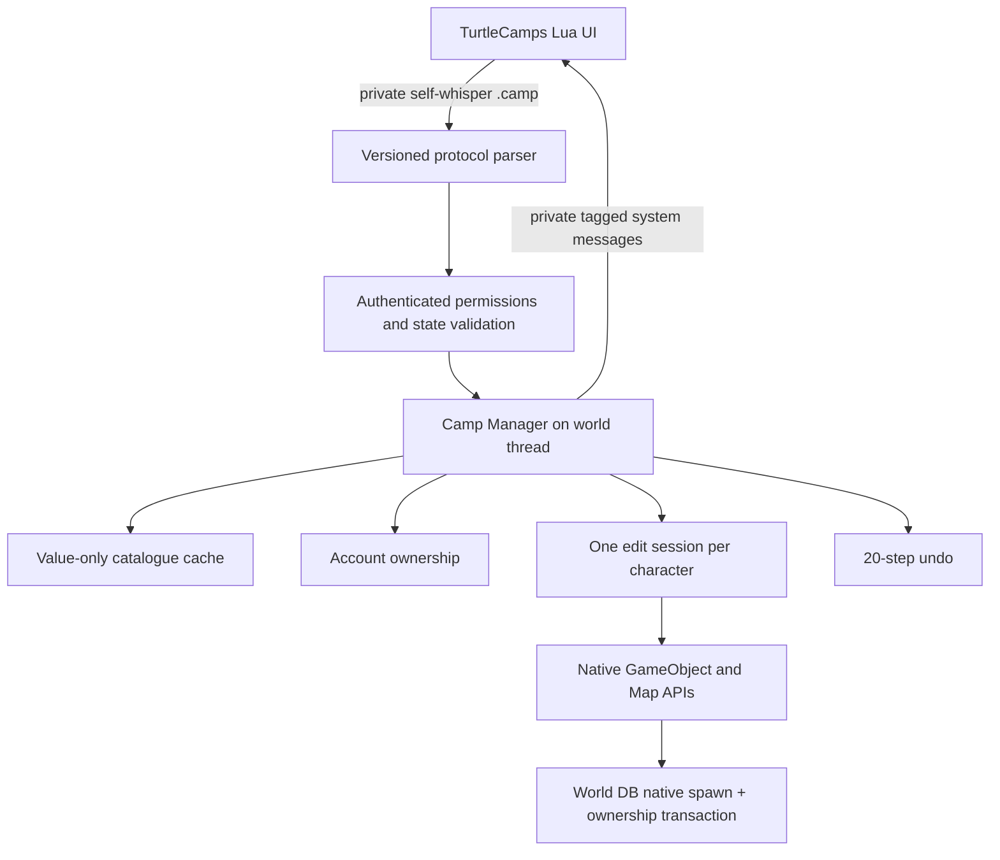

# Runtime architecture

The addon is an untrusted controller. The authenticated WorldSession provides
account identity and security; no request can set an account, map or absolute
coordinate. Selected spawn IDs must resolve to module metadata. GM authority is
SEC_DEVELOPER or higher, matching native gobject commands. GM world mode bypasses
camp radius/cap/map-0/1 rules but still requires a safe template, non-instanced map,
valid nearby coordinates, alive/out-of-combat player and no transport.

## Execution ownership
AllCommandScript dispatch occurs inside CMSG_MESSAGECHAT, registered as
PACKET_PROCESS_WORLD. WorldScript::OnUpdate executes after MapManager's joined
map jobs. Only these owner phases access mutable manager maps and native objects.
Player teleport/logout notifications enqueue copied character IDs under a mutex;
they do not resolve objects or mutate maps on a map worker. Cleanup drains on the
next world tick. Shutdown cleans before maps are unloaded. No async SQL callbacks,
retained runtime pointers, or custom background workers exist.

## Preview and persistent lifecycle
Idle -> PreviewNew or EditExisting -> Save or Cancel -> Idle.
New previews use Map::GenerateLocalLowGuid and a temporary active GameObject.
No spawn/metadata row exists until Save. Save creates a separate static GUID using
ObjectMgr, calls Create/SaveToDB, writes ownership in the same world transaction,
confirms the transaction synchronously, then LoadFromDB/Add/registers the grid.
The original temporary preview is removed through the native deferred remove list.

Existing edits capture a value transform and pin the live object active. Deltas
remove/re-add the object through Map, update position/yaw/quaternion and model
position, but do not save. Cancel restores the original pose. Save updates native
spawn data and the grid index. A crash before Save reloads the old native DB pose.
Source GUID locks prevent two editors changing the same spawn at once.

Edit tokens are monotonically issued per process and every edit command verifies
token, current map/instance and deadline. Native continent partitions are tracked
even though they are not dungeon instances. Placement cannot cross into another
map owner; stored props resolve their native partition from their saved position.
The runtime-only GameObjectData partition field is initialized as ObjectMgr's DB
loader does, since native SaveToDB does not fill it for a new spawn.
Logout, teleport, disable/reload, timeout and
shutdown cancel edits. Temporary objects are not personal phases: nearby players
can see them. Persistent objects remain after disable; only previews are removed.

Undo holds copied prop data, never objects, with 20 records per active character.
It supports creation, committed transform and deletion (recreation at the original
GUID). Another character/GM committing the same spawn invalidates stale histories.
Undo has the same permission, location, cap and safety checks as forward edits.
Reload/logout clears history; undo is not durable across restart.

## Catalogue and persistence
The already-loaded native GameObjectInfo map is the template authority. At startup
and reload, a bounded value cache admits strictly decorative generic types after
script/quest/display/payload checks. A small world table supplies optional category
and player-permission overrides. Search never queries SQL. See
[catalogue-safety.md](docs/catalogue-safety.md) and [database.md](docs/database.md).

All table writes are numeric, server-derived values. The two metadata tables share
WorldDatabase with gameobject; no cross-database atomicity is claimed. Engine checks
fail closed on native MyISAM installations. Native APIs update their in-memory
cache before SQL completes; failed transactions restore cached values where
possible and latch building off until restart. Native migration logging is not a
transactional audit trail; review it separately after a failure.

## Client and optional systems
The addon has no SQL, rendering-engine, .NET or JavaScript dependency. It uses
vanilla event globals and mouse-operated directional buttons. MSUIClient's gesture
ownership and working-copy concepts inform the UI, but its raycast/gizmo engine is
not available to the stock client. There is no scale editor. Dynamic collision
depends on target model/collision assets; navigation meshes are not regenerated.
PlayerBots gathering is not integrated; account-wide ownership still works for
ordinary alts. See ADR-005 for the boundary.
